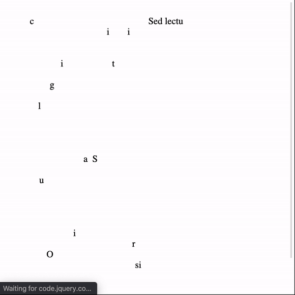

# jquery-typoglycemia #

[](https://www.npmjs.com/package/jquery-typoglycemia/)
[](https://www.npmjs.com/package/jquery-typoglycemia)
[](https://www.npmjs.com/package/jquery-typoglycemia)
[](https://www.jsdelivr.com/package/gh/jrquick17/jquery-typoglycemia)



## Index ##

* [About](#about)
* [Setup](#setup)
* [Documentation](#documentation)
* [Contributing](#contributing)
* [Issues](#issues)
* [Deploy](#deploy)

## About ## 

A jQuery function for making text appear with more spazaz. 

* Try out [the demo](https://jquery-typoglycemia.jrquick.com) to see it in action!
* Visit [my website](https://jrquick.com) for other cool projects!

## Setup ##

### Install ###

### Node ###

```
npm install jquery-typoglycemia --save
```

### CDN ###

```
<script src="https://cdn.jsdelivr.net/gh/jrquick17/jquery-typoglycemia/typoglycemia.js"></script>
```

## Documentation ##

```javascript
$('#text').delayText();
```

### Options ###

* `sequential` -- Reveal text in order (Default: `false`)
* `time` -- Total time to reveal full text (Default: `1000`)

## Contributing ##

### Thanks ###

* [jrquick17](https://github.com/jrquick17)

## Issues ##

If you find any issues feel free to open a request in [the Issues tab](https://github.com/jrquick17/jquery-typoglycemia/issues). If I have the time I will try to solve any issues but cannot make any guarantees. Feel free to contribute yourself.

## Deploy ##

#### NPM Release ####

* Run `npm run shipit`

#### Update Changelog ####

* Add updates to `CHANGELOG.md` in root.
